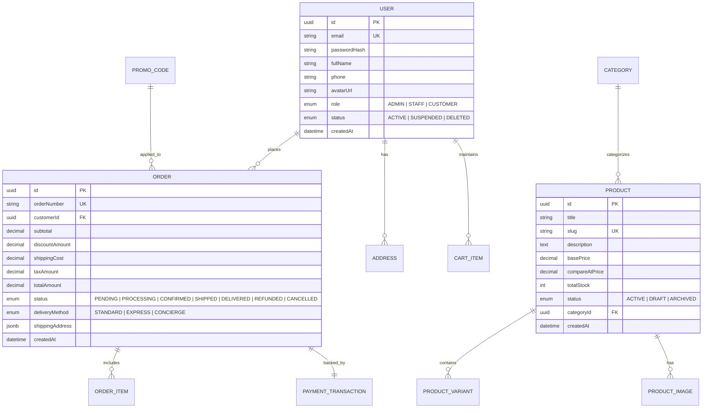

# VASTRAX Backend API Specification & Tech Stack Architecture

A comprehensive technical blueprint and complete API reference for the **VASTRAX** Luxury E-Commerce Storefront and Cyber-Luxury Admin Dashboard.

---

## 1. Recommended Technology Stack

| Layer | Recommended Technology | Rationale |
| :--- | :--- | :--- |
| **Runtime & Framework** | **Next.js 15 / 16 (App Router)** | Unifies SSR, Server Components, Route Handlers (`/api/*`), and Server Actions with minimal latency. |
| **Primary Database** | **PostgreSQL (v16+)** via Supabase / Neon / AWS RDS | Strict ACID compliance for financial orders, relational integrity for products/variants, JSONB support for flexible metadata. |
| **ORM / Data Access** | **Prisma** or **Drizzle ORM** | End-to-end TypeScript safety, automatic migrations, and schema validation. |
| **Authentication & RBAC**| **Auth.js (NextAuth v5)** or **Supabase Auth** | Multi-role session management (`ADMIN`, `STAFF`, `CUSTOMER`), JWT token rotation, secure cookie handling, OAuth & Magic Links. |
| **Media / Asset Storage**| **Cloudflare R2** or **AWS S3** | S3-compatible, zero-egress fees, high-speed CDN delivery for high-res lookbooks and user avatar uploads. |
| **Payment Gateway** | **Stripe API (PaymentIntents + Elements)** | Native Apple Pay, Google Pay, 3D Secure 2 compliance, and webhook events for automated fulfillment. |
| **Transactional Email** | **Resend** + **React Email** | Clean luxury HTML email receipts, order tracking updates, and password reset notifications. |
| **Caching & Rate Limiting**| **Upstash Redis** | Distributed rate limiting on sensitive auth endpoints, search cache, and live cart sessions. |
| **Virtual Try-On Hook** | **Dedicated Microservice Webhook** | Pre-configured inference method wrapped via async job worker / internal proxy endpoint. |

---

## 2. Core Database Schema & Relations



---

## 3. Complete API Endpoint Reference

### 3.1 Authentication & User Profile (`/api/auth`, `/api/user`)

#### `POST /api/auth/register`
* **Access:** Public
* **Description:** Creates a new customer account.
* **Request Body:**
  ```json
  {
    "fullName": "Alexandra Vance",
    "email": "alexandra@example.com",
    "password": "SecurePassword123!",
    "phone": "+15553829912"
  }
  ```
* **Response (201 Created):**
  ```json
  {
    "success": true,
    "user": {
      "id": "usr_94b1c8f3",
      "email": "alexandra@example.com",
      "fullName": "Alexandra Vance",
      "role": "CUSTOMER"
    },
    "token": "eyJhbGciOi..."
  }
  ```

#### `POST /api/auth/login`
* **Access:** Public
* **Request Body:** `{ "email": "...", "password": "..." }`
* **Response (200 OK):** User profile, role, and HttpOnly session cookie.

#### `POST /api/auth/forgot-password`
* **Access:** Public
* **Request Body:** `{ "email": "..." }`
* **Response (200 OK):** `{ "message": "Password reset instructions dispatched." }`

#### `GET /api/user/profile`
* **Access:** Authenticated (`CUSTOMER` | `ADMIN`)
* **Response (200 OK):** Profile details, order count, default addresses.

#### `PATCH /api/user/profile`
* **Access:** Authenticated
* **Request Body:** `{ "fullName": "...", "phone": "...", "avatarUrl": "..." }`

---

### 3.2 Storefront APIs (`/api/storefront/*`)

#### `GET /api/storefront/home`
* **Access:** Public
* **Description:** Consolidated payload for landing page (hero slider, active campaigns, featured collections, top categories).
* **Response (200 OK):**
  ```json
  {
    "heroBanner": {
      "title": "Elevate your Style",
      "subtitle": "In the language of beauty, every detail tells a tale.",
      "ctaUrl": "/storefront/product",
      "imageUrl": "https://images.unsplash.com/photo-1445205170230-053b83016050"
    },
    "categories": [
      { "id": "cat_01", "name": "T-Shirts", "imageUrl": "..." }
    ],
    "collections": [
      { "id": "col_01", "title": "CREAM PULLOVER HOODIE", "imageUrl": "..." }
    ],
    "announcement": "Complimentary Global Express Delivery on Orders Over $250"
  }
  ```

#### `GET /api/storefront/products`
* **Access:** Public
* **Query Parameters:**
  - `category` (string, optional) - Category slug
  - `sort` (string: `recommended` | `newest` | `price_asc` | `price_desc` | `rating`)
  - `page` (int, default `1`)
  - `limit` (int, default `12`)
  - `search` (string, optional)
* **Response (200 OK):** Paginated products with thumbnail images, pricing, ratings, and stock status.

#### `GET /api/storefront/products/:slug`
* **Access:** Public
* **Description:** Full product details for PDP.
* **Response (200 OK):**
  ```json
  {
    "id": "prod_101",
    "slug": "teal-five-panel-cap",
    "title": "Teal Five-Panel Cap",
    "price": 45.00,
    "compareAtPrice": 55.00,
    "description": "Low-profile five-panel cap in deep teal cotton...",
    "images": ["url1", "url2"],
    "variants": [
      { "color": "Teal", "size": "One Size", "stock": 14, "sku": "CAP-TEL-01" },
      { "color": "Black", "size": "One Size", "stock": 25, "sku": "CAP-BLK-01" }
    ],
    "relatedProducts": []
  }
  ```

#### `POST /api/storefront/promo/validate`
* **Access:** Public
* **Request Body:** `{ "code": "VASTRAX10", "subtotal": 165.00 }`
* **Response (200 OK):**
  ```json
  {
    "valid": true,
    "code": "VASTRAX10",
    "discountPercent": 10,
    "discountAmount": 16.50
  }
  ```

---

### 3.3 Checkout & Payment APIs (`/api/checkout/*`)

#### `POST /api/checkout/create-payment-intent`
* **Access:** Public (Supports Guest Checkout)
* **Description:** Initializes a Stripe PaymentIntent and reserves temporary inventory hold.
* **Request Body:**
  ```json
  {
    "items": [
      { "productId": "prod_101", "variantId": "var_01", "quantity": 1 }
    ],
    "deliveryMethod": "express",
    "promoCode": "VASTRAX10"
  }
  ```
* **Response (200 OK):**
  ```json
  {
    "clientSecret": "pi_3MtwBwLkdIwHu7ix28a3tqPa_secret_YrKJ...",
    "subtotal": 165.00,
    "discount": 16.50,
    "shipping": 15.00,
    "tax": 13.08,
    "total": 176.58
  }
  ```

#### `POST /api/checkout/place-order`
* **Access:** Public / Customer
* **Description:** Finalizes the order record after payment verification or for COD.
* **Request Body:**
  ```json
  {
    "paymentMethod": "card",
    "paymentIntentId": "pi_3MtwBwLkdIwHu7ix28a3tqPa",
    "customer": {
      "email": "alexandra@example.com",
      "phone": "+15553829912",
      "firstName": "Alexandra",
      "lastName": "Vance"
    },
    "shippingAddress": {
      "address": "742 Evergreen Terrace",
      "apartment": "Penthouse 4B",
      "city": "New York",
      "postalCode": "10001",
      "country": "United States"
    },
    "deliveryMethod": "express",
    "items": [{ "productId": "prod_101", "quantity": 1, "price": 45.00 }]
  }
  ```
* **Response (201 Created):**
  ```json
  {
    "success": true,
    "orderNumber": "VX-849201",
    "orderId": "ord_a7f92e10",
    "totalAmount": 176.58,
    "estimatedDelivery": "2026-08-20T20:00:00Z"
  }
  ```

#### `POST /api/webhooks/stripe`
* **Access:** Stripe Webhook Signature verified
* **Events handled:** `payment_intent.succeeded`, `payment_intent.payment_failed`, `charge.refunded`.

---

### 3.4 Virtual Try-On Service API (`/api/storefront/virtual-try-on`)

*(Wraps the existing figured-out inference model pipeline)*

#### `POST /api/storefront/virtual-try-on`
* **Access:** Public / Rate-limited
* **Request Body (Multipart or JSON):**
  ```json
  {
    "productId": "prod_101",
    "garmentImageUrl": "https://assets.vastrax.luxury/products/teal-cap.png",
    "userPhotoBase64": "data:image/jpeg;base64,...",
    "category": "hats"
  }
  ```
* **Response (200 OK):**
  ```json
  {
    "status": "COMPLETED",
    "outputImageUrl": "https://assets.vastrax.luxury/tryon/res_98f1a23b.webp",
    "processingTimeMs": 850
  }
  ```

---

### 3.5 Admin Dashboard & Analytics APIs (`/api/admin/metrics/*`)

#### `GET /api/admin/metrics/overview`
* **Access:** Admin (`ADMIN` | `STAFF`)
* **Description:** Powers the Bento-grid metric cards on `/`.
* **Response (200 OK):**
  ```json
  {
    "revenue": {
      "total": 319200.00,
      "changePercent": 14.6,
      "trend": "UP"
    },
    "customers": {
      "total": 8420,
      "growthPercent": 8.2,
      "retentionRate": 74.5
    },
    "salesWeekly": {
      "labels": ["Mon", "Tue", "Wed", "Thu", "Fri", "Sat", "Sun"],
      "values": [4200, 6800, 5100, 9200, 8400, 11500, 13400]
    },
    "conversionRate": {
      "rate": 3.42,
      "change": 0.8
    }
  }
  ```

#### `GET /api/admin/metrics/regional-sales`
* **Access:** Admin
* **Description:** Feeds geographic data to the interactive world map.
* **Response (200 OK):**
  ```json
  {
    "regions": [
      { "countryCode": "US", "countryName": "United States", "revenue": 142000, "orders": 890 },
      { "countryCode": "GB", "countryName": "United Kingdom", "revenue": 68000, "orders": 410 },
      { "countryCode": "SA", "countryName": "Saudi Arabia", "revenue": 54000, "orders": 290 },
      { "countryCode": "AE", "countryName": "United Arab Emirates", "revenue": 38000, "orders": 210 }
    ]
  }
  ```

---

### 3.6 Admin Products Management APIs (`/api/admin/products/*`)

| Method | Endpoint | Description |
| :--- | :--- | :--- |
| `GET` | `/api/admin/products` | Paginated product table with filtering, search, and stock status. |
| `POST` | `/api/admin/products` | Create a new product (title, description, variants, pricing, tags). |
| `GET` | `/api/admin/products/:id` | Retrieve single product for edit screen. |
| `PUT / PATCH` | `/api/admin/products/:id` | Update product details, inventory, and images. |
| `DELETE` | `/api/admin/products/:id` | Soft-delete product (moves to archive). |
| `POST` | `/api/admin/products/media-upload` | Pre-signed URL generation for direct Cloudflare R2/S3 upload. |

---

### 3.7 Admin Orders Management APIs (`/api/admin/orders/*`)

| Method | Endpoint | Description |
| :--- | :--- | :--- |
| `GET` | `/api/admin/orders` | Full list of transactions with status filtering and date range. |
| `GET` | `/api/admin/orders/:id` | Order line items, payment logs, and customer shipping address. |
| `PATCH` | `/api/admin/orders/:id/status` | Update fulfillment state (`PROCESSING` &rarr; `SHIPPED` &rarr; `DELIVERED`). |
| `POST` | `/api/admin/orders/:id/tracking` | Attach courier tracking number and auto-dispatch customer email. |
| `POST` | `/api/admin/orders/:id/refund` | Trigger Stripe partial/full refund. |

---

### 3.8 Admin Categories & Taxonomy APIs (`/api/admin/categories/*`)

| Method | Endpoint | Description |
| :--- | :--- | :--- |
| `GET` | `/api/admin/categories` | List active categories with assigned product counts. |
| `POST` | `/api/admin/categories` | Create category (name, slug, thumbnail, banner image). |
| `PUT` | `/api/admin/categories/:id` | Edit category information. |
| `DELETE` | `/api/admin/categories/:id` | Soft delete category. |
| `GET` | `/api/admin/categories/deleted` | List deleted/archived categories. |
| `POST` | `/api/admin/categories/:id/restore`| Restore soft-deleted category. |

---

### 3.9 Admin Users & Access Management (`/api/admin/users/*`, `/api/admin/management/*`)

| Method | Endpoint | Description |
| :--- | :--- | :--- |
| `GET` | `/api/admin/users` | Customer and staff directory with total spend and order counts. |
| `PATCH` | `/api/admin/users/:id/role` | Grant/Revoke admin and staff roles. |
| `PATCH` | `/api/admin/users/:id/status` | Suspend or reactivate user account. |
| `DELETE` | `/api/admin/users/:id` | Soft-delete user. |
| `GET` | `/api/admin/management/audit-logs`| System audit trail for security and access events. |

---

### 3.10 Admin App & Storefront Configuration (`/api/admin/settings/*`)

#### `GET /api/admin/settings/app`
* **Access:** Admin
* **Description:** Retrieves all global store preferences.
* **Response (200 OK):**
  ```json
  {
    "storeName": "VASTRAX Luxury Apparel",
    "supportEmail": "concierge@vastrax.luxury",
    "supportPhone": "+1 (800) 827-8729",
    "currency": "USD ($)",
    "timezone": "UTC-05:00 (Eastern Time)",
    "announcementText": "Complimentary Global Express Delivery on Orders Over $250",
    "enableGuestCheckout": true,
    "enableLowStockAlerts": true,
    "lowStockThreshold": 5,
    "autoArchiveOrders": false,
    "maintenanceMode": false
  }
  ```

#### `PUT /api/admin/settings/app`
* **Access:** Admin
* **Description:** Updates global configuration options in real-time.
* **Request Body:** JSON matching the schema above.
* **Response (200 OK):** `{ "success": true, "updatedAt": "2026-08-18T18:00:00Z" }`

---

## 4. Security, Rate Limiting & Error Standard

### Error Response Standard (RFC 7807)
All API endpoints return standard structured errors:
```json
{
  "error": {
    "code": "INSUFFICIENT_STOCK",
    "message": "The selected item only has 2 pieces remaining in stock.",
    "field": "quantity",
    "timestamp": "2026-08-18T18:00:00Z"
  }
}
```

### Rate Limiting Policy
- **Public Browsing:** 120 req / min per IP.
- **Authentication Routes (`/api/auth/*`):** 5 failed attempts / 15 min per IP.
- **Virtual Try-On Route:** 10 generation calls / hour per IP or user token.
